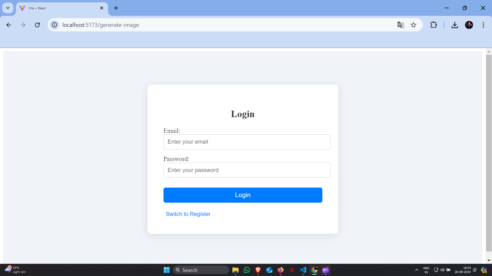
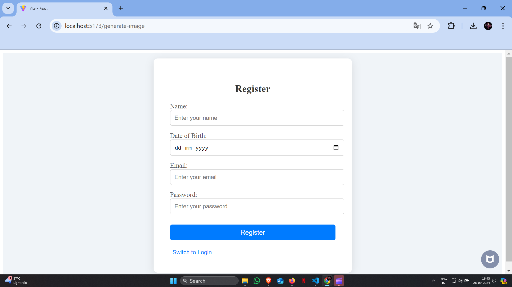
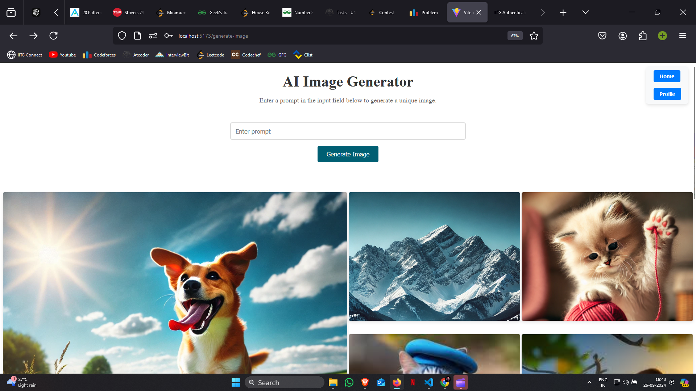
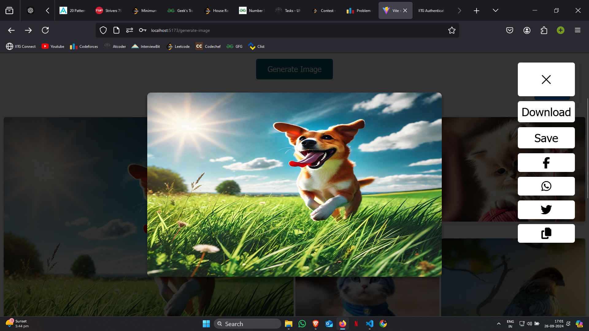
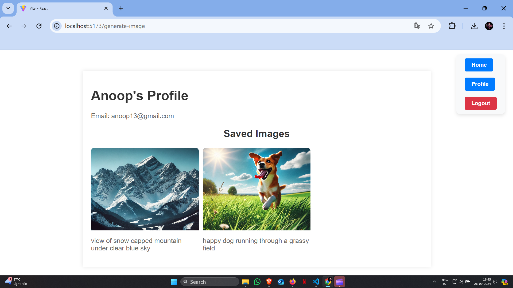

# My AI Image Generator Project

fluffy kitten playing with a ball of yarn
view of snow-capped mountains under a clear blue sky
happy dog running through a grassy field
night sky filled with bright stars and a glowing moon

## Table of Contents

- [Overview](#overview)
- [Demo](#demo)
- [Screenshots](#screenshots)
- [Features](#features)
- [Installation](#installation)
- [Usage](#usage)
- [Feedback](#feedback)

## Overview

The AI Image Generator is a web application that allows users to generate images based on text prompts. Built with React for the frontend and Node.js for the backend, this platform provides a seamless experience for users to create and save images, manage profiles, and share generated images with others.

## Demo

https://github.com/user-attachments/assets/84301120-3655-4af4-85fd-387d5f7f04dc

## Screenshots

Here are some screenshots of the Website to give you a glimpse of its various pages and features.

## Login Page



## Registration Page



## Home Page



## View Image Page



## User Profile Page



These screenshots provide an overview of the website's design and user interface. The actual website may have additional features and pages not depicted here.

## Features

### 1. User Authentication

- Secure login and registration system.
- Manage profiles with personalized details.

### 2. Image Generation

- Enter a text prompt and generate an AI-powered image.
- View generated images on the main page.

### 3. Image Viewing & Sharing

- View individual images in detail.
- Download, save, or share images across various platforms.


### 4. Profile Management

- View and manage your profile, including saved images.


## Installation

Follow these steps to set up the Social Networking Website on your local machine:

### Prerequisites

- Node.js and npm installed on your system.

### 1. Clone the repository

```bash
git clone https://github.com/anoop7384/IMAGE_GENERATOR.git
```

### 2. Install dependencies for both frontend and backend

```bash
# Frontend
cd frontend
npm install

# Backend
cd backend
npm install
```

### 3. Start the development servers

```bash
# Frontend
cd frontend
npm run dev

# Backend
cd backend
node app.js
```

The frontend will be available at http://localhost:5173, and the backend will be running on http://localhost:9000.

## Usage

Sign up for a new account or log in to generate AI images based on your text input.

Explore your profile to manage saved images and view image details.

Share generated images on social media or download them directly.

## Feedback

We appreciate your feedback and are dedicated to providing a positive user experience. If you have any suggestions, encounter issues, or need support, please reach out to our support team at anoop553407@gmail.com.
